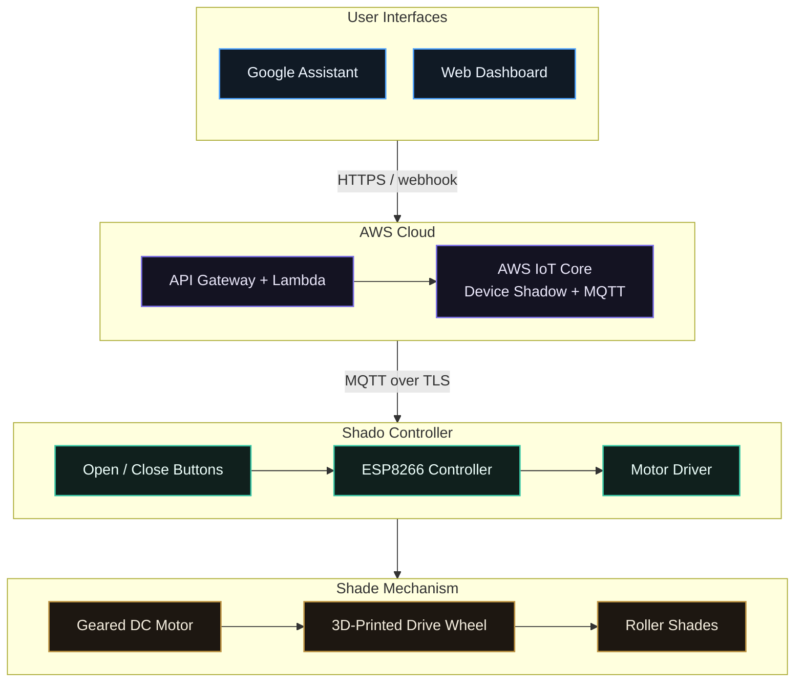
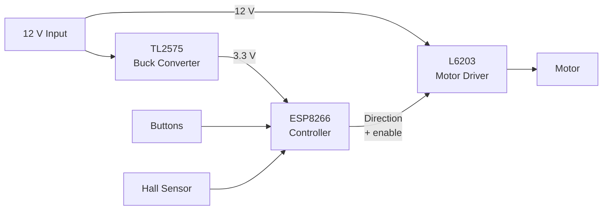
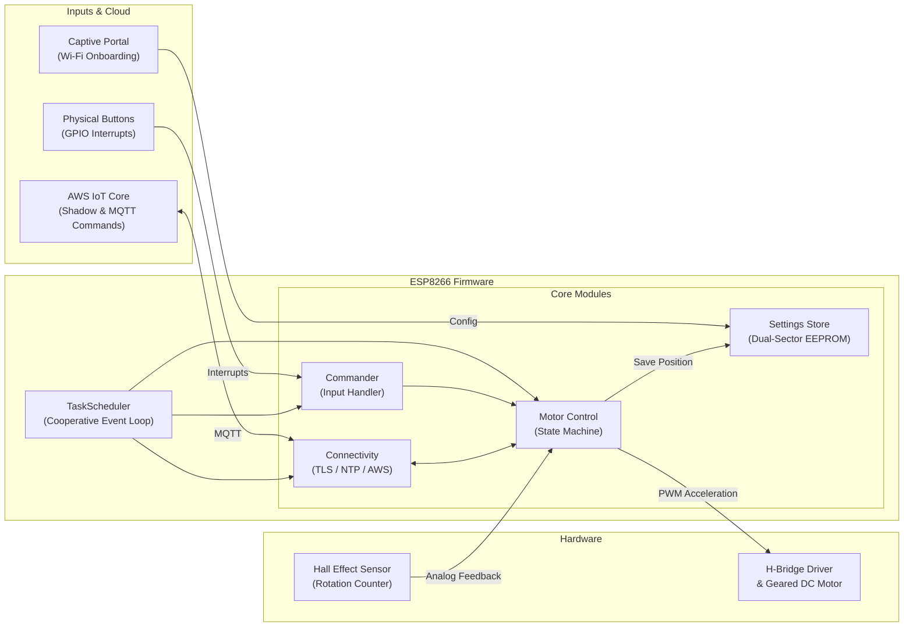
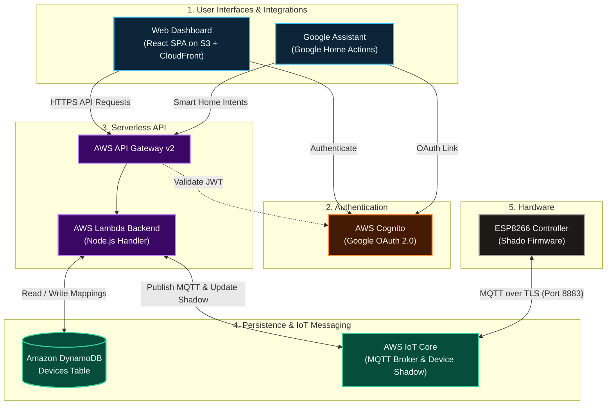

A few weeks after moving into a new apartment, I started getting annoyed by a minor yet recurring problem: having to raise and lower my shades every morning and night.
Wouldn't it be great if they did that on their own?

Around the same time, I came across the AXIS Gear.
For \$250 a pop, it promised to retrofit your existing dumb shades and bring them to the world of IoT.
Outfitting the two shades in my room would cost \$500, and retrofitting the whole apartment would approach \$3,000, so going down the DIY route started to make sense.
It also sounded much more fun and rewarding.

<figure>
  
  <figcaption>My window with the shades</figcaption>
</figure>

After several months of designing circuits, 3D-printing mechanical parts, writing firmware, and integrating with Google Assistant, I had a working system.
I called it Shado.

<figure>
  <video controls playsinline preload="metadata">
    <source src="/images/writing/building-my-own-smart-roller-shades/shado.mp4" type="video/mp4" />
  </video>
  <figcaption>"OK Google, open the <s>shades</s> blinds."</figcaption>
</figure>

> **A note on timing:** I originally built Shado between 2019 and 2020 and revisited it intermittently afterward. It worked well enough to control the shades, though I never completed the final mechanical revision needed for long-term reliability before moving out of the apartment.

## What I wanted to build

The core requirement was simple: build a contraption to pull on the existing beaded chain of my roller shade without modifying the shade itself.
For it to be truly useful, it also needed to:

- Lift the largest shade in my room without stalling and in under 30 seconds.
- Include physical controls so anyone could operate it.
- Connect to Wi-Fi without hardcoded credentials.
- Support control from a browser and Google Assistant.
- Fit into a wall-mounted enclosure I could print at home.
- Be adaptable to the other, slightly different shades in the apartment.

## How Shado works

At a high level, each shade is driven by a geared DC motor connected to a custom ESP8266-based controller.
A 3D-printed drive wheel pulls the shade's existing beaded chain, with the motor and PCB held against the wall by a custom printed enclosure.

The controller accepts input from two physical buttons or receives a command over Wi-Fi via MQTT.
A cloud service provides browser-based controls and integrates with Google Assistant, allowing a voice command to travel from Google to the service, down to the device, and ultimately to the motor.



The project thus broke down into four major pieces:

1. A motor and drive-wheel assembly strong enough to move the shade.
2. A custom circuit board to control it.
3. Firmware for motor control, Wi-Fi provisioning, and communication.
4. A web service that controls the device and connects it to Google.

## Choosing the motor

Choosing the right motor required estimating both the force needed to move the shades and the desired speed.
A rough estimate would be good enough — I did not have a spring scale, so I tied a pair of cheap earbuds around the chain and hung plates from some dumbbells I had lying around.

<figure style="max-width: 75%; margin: 24px auto;">
  
</figure>

By attaching progressively heavier weights, I could get a rough sense of the force needed to open the shade.
Each plate weighed in at around $\qty{2.5}{lb}$, and it turned out that I needed 1–2 of them to start lifting the smaller shade, and 2–3 for the larger one.
Converting to metric, the heaviest case was equivalent to the weight of roughly $\qty{3.5}{\kilogram}$, or about $\qty{34}{\newton}$. I treated that as the practical lower bound for choosing the motor.

For the drive mechanism, I estimated an effective wheel diameter of roughly $\qty{3}{\centimeter}$ and about $\qty{250}{\centimeter}$ of chain travel from fully closed to fully open.

<figure style="max-width: 75%; margin: 24px auto;">
  
  <figcaption>Contact lens cap for scale.</figcaption>
</figure>

While half a minute to pull the shades up was acceptable, I wanted to set a more aggressive design target of 15 seconds.
Given a drive wheel of diameter $d$, the motor must complete $l/(\pi d)$ revolutions to pull $l$ centimeters of chain. Therefore, its required speed is:

$$
n_{\mathrm{rpm}}
= \frac{l}{\pi d t} \cdot \frac{\qty{60}{\s}}{\unit{\min}}
= \frac{\qty{250}{\cm}}{\pi \cdot \qty{3}{\cm} \cdot \qty{15}{\s}} \cdot \frac{\qty{60}{\s}}{\unit{\min}}
\approx \boxed{\qty{106}{rpm}}
$$

As for the torque:

$$
\begin{aligned}
\tau
  &= Fr = mgr \\
  &= \qty{3.5}{\kg} \cdot \qty{9.80665}{\m/\s^2} \cdot \qty{0.015}{\m} \\
  &\approx \qty{0.515}{N\meter}
  \approx \boxed{\qty{5.25}{kgf\cdot cm}}
\end{aligned}
$$

Plugging that in, I could compute the required mechanical output power to be:

$$
\begin{aligned}
P
  &= \tau\omega \\
  &= (mgr)\left(n_{\mathrm{rpm}} \cdot \frac{2\pi}{60}\right) \\
  &= (\qty{3.5}{\kg} \cdot \qty{9.80665}{\m/\s^2} \cdot \qty{0.015}{\m})
     \left(\qty{106}{rpm} \cdot \frac{2\pi}{60}\right) \\
  &\approx \boxed{\qty{5.7}{W}}
\end{aligned}
$$

These numbers were theoretical, with additional margin needed for gearbox and motor losses, starting friction, and variations in shade resistance. Still, they gave me a useful starting point for choosing a motor and power supply.
After spelunking on Amazon, I found a promising candidate: a [uxcell worm gear motor](https://www.amazon.com/dp/B072B83JY4) ([screenshot](/images/writing/building-my-own-smart-roller-shades/uxcell_motor_product_page.png)) for ~\$20.

<figure style="max-width: 75%; margin: 24px auto;">
  
  <figcaption>Seems to look robust enough—will it be?</figcaption>
</figure>

On paper, it had these specs:

- $\qty{110}{rpm}$ — though this was the no-load speed, so the actual speed would be lower.
- $\qty{8}{kgf\cdot cm}$ of stall torque — about 50% above my estimate, although stall torque is not directly comparable to the torque available at speed.
- $\qty{12}{V}$ DC, which meant I would need a buck converter for the ESP8266.
- Reasonable dimensions for the gearbox, and an $\qty{8}{mm}$ shaft that the drive wheel could fit onto.

With a suitable motor in hand, I could now turn my attention to the mechanical assembly.

## Building the drive mechanism

A few months ago, I came across a 3D printer on Marketplace for just shy of \$100: the [New Matter MOD-t](https://www.biline.ca/3dmod-t.htm).
I had fun making shot glasses and 3D-printed figures, but it was time to start putting it to something useful.
The filament it came with was PLA, which was a bit too malleable for the parts that were supposed to handle torque.
ABS might have been a better mechanical choice, but the toxic fumes didn't seem that appealing for home printing—and the MOD-t didn't support ABS or PETG anyway.
Looking for the toughest PLA available, I came across [PolyMax PLA](https://shop.polymaker.com/products/polymax-pla), which I figured I could use for the drive wheel.
Then, for the enclosure, I ordered some cheaper [Amazon Basics filament](https://www.amazon.com/dp/B07H9KW5P9).

It was then time to brush up on my 3D modeling skills.
Although I had some experience with SolidWorks and AutoCAD from first-year engineering courses, I had not touched 3D-modeling software since.
After seeing the benefits of infrastructure as code, I knew I would enjoy a tool that let me generate and refine 3D models programmatically.
[OpenSCAD](https://openscad.org) seemed perfect.
I could write and iterate on my designs in code, generate an STL file, open it in [UltiMaker Cura](https://ultimaker.com/software/ultimaker-cura/), and then export G-code to the printer.

### Designing the drive wheel

The drive wheel was the first part I started with, and I knew I'd need to go through several iterations.
My first design was a sprocket of sorts that had just the right grooves to grip the metal beads.

<figure>
  
  <figcaption>My <a href="https://github.com/vaskevich/shado/blob/4b31024e89965597d087d73bd5d97913a447dda3/hardware/gear.scad">first attempt</a> at 3D modeling a drive wheel.</figcaption>
</figure>

And thanks to WebGL, here's that same interactive model:

<model-viewer src="/images/writing/building-my-own-smart-roller-shades/models/gear1.glb?v=6" camera-controls auto-rotate rotation-per-second="60deg" auto-rotate-delay="0" camera-orbit="45deg 65deg 100%" orientation="0deg 90deg 0deg" shadow-intensity="1.5" shadow-softness="1" exposure="0.75" environment-image="neutral" touch-action="pan-y" style="width: 100%; height: 500px; background-color: #1a1a1a;"></model-viewer>

My 3D printer was essentially unsupported, but thanks to a [Reddit community](https://www.reddit.com/r/newmatter/), and a bit of experimentation, I was able to get it up and running.

<figure>
  
</figure>

Suffice it to say, it took a few tries to find the right printer settings, notch spacing, and tolerance to get a drive wheel that gripped both the shaft and chain reliably enough for testing. Eventually, I had something workable.


## Designing the electronics

With the motor and drive wheel selected, I needed a control system that could do three things: run the motor in either direction, accept commands over the internet, and support a pair of physical open and close buttons.

For the controller, I decided to use an ESP8266, a small, Wi-Fi-enabled chip often available for under \$2 online.
To make it easier on myself, I went with a [Wemos D1 mini](https://www.wemos.cc/en/latest/d1/d1_mini_3.1.0.html) development board, which exposed 11 digital I/O pins and one analog input, and included a Micro-USB connector for flashing it.

And with that, I had my first electrical challenge.
The motor ran at $\qty{12}{\volt}$ and required significant current, while the ESP8266 operated at $\qty{3.3}{\volt}$.
I wanted the whole device to use a single power adapter, so I needed a way to efficiently produce a stable $\qty{3.3}{V}$ supply from the motor's input.

### Powering the controller

I initially explored the [LM1117](https://www.ti.com/lit/ds/symlink/lm1117.pdf) linear voltage regulator, but it became quite hot while dissipating the excess voltage as heat.
A [buck converter](https://en.wikipedia.org/wiki/Buck_converter) was the better choice, and so I got one working with an [TL2575-33IN](https://www.ti.com/lit/ds/symlink/tl2575-33.pdf) and an inductor, diode, and capacitors to step the voltage down more efficiently.

<figure>
  
  <figcaption>Testing the 3.3 V buck converter on a breadboard before attaching the microcontroller.</figcaption>
</figure>

### Reversing the motor

The next problem was controlling the motor and its direction.
The ESP8266 could not drive it directly.
Its GPIO pins provide only low-power control signals, while the motor required substantially more voltage and current.
For that, I needed an [H-bridge](https://en.wikipedia.org/wiki/H-bridge).
I began by experimenting with one built from N- and P-channel MOSFETs, but after blowing a few out while running the motor, I caved and bought the [L6203](https://www.st.com/en/motor-drivers/l6203.html) integrated full-bridge driver.

I combined the regulator and motor driver on perfboard and powered them with a 12 V, 5 A AC-to-DC adapter connected through a barrel jack. At last, I had an initial prototype:

<figure>
  
  <figcaption>Not pictured: the underside with amateur-level soldering.</figcaption>
</figure>

### Tracking the shade position

The prototype worked, and a basic program could now run the motor in either direction.
Holding it against the beaded chain, I noticed that the motor slowed down a fair bit under load. The controller also needed a way to know how far the shade had moved, both to report its position and to know when to stop.

To add this position tracking, I integrated a small magnet into the drive wheel.
With a [Hall-effect sensor](https://en.wikipedia.org/wiki/Hall_effect_sensor) taped to the base of the motor, the controller could detect each revolution of the drive wheel.

<figure style="max-width: 75%; margin: 24px auto;">
  
  <figcaption>Turns out the analog input on the Wemos D1 mini would come in handy after all!</figcaption>
</figure>

### From hand-wired prototype to PCB

After a few trips to Jameco Electronics near San Mateo, I had what seemed like a viable design.
Putting it all together, the control circuit looked something like this:



My perfboard prototype worked, but it was bulky, difficult to reproduce if I wanted more than one, and frankly a bit unsightly.
It was time to take things to the next level.

I had always pictured custom PCBs as being out of reach for all but the most well-funded projects.
So when I discovered that I could have five boards fabricated and delivered within a few days for \$20, I jumped at the opportunity.
There are several PCB manufacturers on the market, but I went with [PCBWay](https://www.pcbway.com).
(If you haven't seen it already, check out [this tour](https://www.youtube.com/watch?v=lVyxlw3rixI) of their Shenzhen factory.)

### Schematic and board layout

The first step in creating a custom PCB was designing the schematic with the right tool.
At the time, I got started with Autodesk EAGLE (now Fusion 360), but the newer versions of [KiCad](https://www.kicad.org/) would have also worked.
After a lot of pointing and clicking, and with the help of [SparkFun's libraries](https://github.com/sparkfun/SparkFun-Eagle-Libraries), I had a presentable design.

<figure class="breakout">
  
  <figcaption>At the top left, the controller is connected to two buttons, the Hall effect sensor, and the motor driver, with an LED and a couple pull-up resistors. The motor driver below, based on the L6203, uses two bootstrap capacitors for its charge pump, alongside a sense resistor for current feedback and a decoupling capacitor to stabilize the reference voltage. It's powered by the 12 V input to the right, which also feeds into the buck converter above it. The buck converter, centered around the TL2575-33IN, steps the 12 V power supply down to 3.3 V using an input filter capacitor, an inductor, a Schottky catch diode for energy storage and freewheeling current during switching, along with an output smoothing capacitor. View the full schematic <a href="/images/writing/building-my-own-smart-roller-shades/schematic.pdf">here</a>.</figcaption>
</figure>

The next part was the board layout.
Following some [tutorials](https://learn.sparkfun.com/tutorials/using-eagle-board-layout/) and [videos](https://www.youtube.com/watch?v=5nLONfdh7vw) online, I arranged all the parts, routed them together with traces and vias (it's like solving a puzzle!), and validated the board for errors.

<figure class="breakout">
  
  <figcaption>Autodesk Fusion showing the top layer of the 2-layer design for the circuit. If you look closely, you can see all the components laid out and connected. A copper pour gives it a red finish here.</figcaption>
</figure>

### Sending it to the fab

With the design ready, it was time to have the boards fabbed.
Exporting the [Gerber files](https://www.autodesk.com/products/fusion-360/blog/a-history-of-gerber-files-and-the-man-who-made-them/) from Fusion 360, I sent them to PCBWay.
Someone reviewed them, and just shy of 24 hours later I was notified that the boards I requested were ready to be shipped.
The whole process was astoundingly fast.

<figure style="max-width: 75%; margin: 24px auto;">
  
</figure>

It also didn't take long to get the boards delivered, and they looked phenomenal.

<figure style="max-width: 75%; margin: 24px auto;">
  
</figure>

### Assembling the board

Compared with the perfboard, the PCB was much easier to work with.
The parts fit onto the board like a glove, and I just had to carefully solder them in place and clip off excess leads.

<figure>
  
  <figcaption>The final assembly of the PCB.</figcaption>
</figure>

### Wiring the remaining components

The final step was connecting the board to the remaining components: the motor, Hall effect sensor, and physical buttons.
Since I wanted to adjust those more easily, I used a [Dupont connector kit](https://www.amazon.com/dp/B078RRPRQZ) with a [crimping tool](https://www.amazon.com/dp/B00OMM4YUY) to set up headers and removable wires.

<figure>
  
  <figcaption>Orange crimping tool for <a href="https://www.instructables.com/Dupont-Crimp-Tool-Tutorial">solder-free connectors</a>. The blue wire stripper also came in useful.</figcaption>
</figure>

## Designing the enclosure

With the drive mechanism working and the PCB dimensions finalized, I could finally design the enclosure that would house everything in a neat package.
This was not just for aesthetics: I also needed a way to mount the assembly on the wall while keeping the beaded chain under the right amount of tension.

Firing up OpenSCAD, I started by figuring out how to get the motor's unwieldy shape into a chassis that could hold it.
I also needed a place for the PCB, so I built a small platform with grooves that it could slide into.

<model-viewer src="/images/writing/building-my-own-smart-roller-shades/models/motor_chassis.glb?v=6" camera-controls auto-rotate orientation="-45deg -90deg 180deg" shadow-intensity="1.5" shadow-softness="1" exposure="0.75" environment-image="neutral" touch-action="pan-y" style="width: 100%; height: 500px; background-color: #1a1a1a;"></model-viewer>

To print it, I split the chassis into smaller parts and superglued them together. This avoided supports, which were error-prone and increased both print time and filament usage.

For the wall mount, I designed a base plate with a dovetail groove. A matching insert on the underside of the chassis allowed it to slide into place—try rotating the model above to see it.
After mounting the base plate, I could still adjust the chain tension by placing small trapezoidal spacers in the groove to change the chassis offset.

<model-viewer src="/images/writing/building-my-own-smart-roller-shades/models/mounting_plate.glb?v=8" camera-controls auto-rotate camera-orbit="45deg 60deg 105%" orientation="0deg -90deg 90deg" shadow-intensity="1.5" shadow-softness="1" exposure="0.75" environment-image="neutral" touch-action="pan-y" style="width: 100%; height: 500px; background-color: #1a1a1a;"></model-viewer>

To finish up the enclosure, I added a chamfered removable shell with integrated button caps (and an interior mount for the switches), an opening for an LED, and an inset logo.

<model-viewer src="/images/writing/building-my-own-smart-roller-shades/models/full_assembly.glb?v=17" camera-controls autoplay auto-rotate toggle-cover orientation="20deg -90deg 180deg" shadow-intensity="1.5" shadow-softness="1" exposure="0.75" environment-image="neutral" touch-action="pan-y" style="width: 100%; height: 500px; background-color: #1a1a1a;"></model-viewer>

It was time to get everything printed and glued.
As always, it took a few attempts (and misprints) to get it right, but I could now move on to writing some code.

<figure>
  
  <figcaption>To print out the shell, I had to break it up into two pieces. Perhaps modern 3D printers would fare better, but I had more trouble with misprints when relying on supports.</figcaption>
</figure>

## Writing the firmware

Compared with the mechanical and electrical work, writing code was much more familiar territory, though previous embedded systems projects had taught me that it would have its own challenges.
Developing the firmware was largely iterative, but the final architecture looked like this:



### Adding cooperative multitasking

The ESP8266 runs on a single 80 MHz core with limited resources (~80 KB of available RAM).
Despite that, it had to manage the motor, maintain its cloud connection, and remain responsive to physical controls.
A single monolithic loop would quickly become difficult to manage, and integrating the [TaskScheduler library](https://github.com/arkhipenko/TaskScheduler) kept the different tasks responsive while leaving the main loop [dead simple](https://github.com/vaskevich/shado/blob/b0f8df77ad48371fb17153f9f9d06d4fd0e58b42/firmware/firmware.ino#L51):

```cpp
void loop() { runner.execute(); }
```

### Controlling and tracking the shades

At the end of the day, the controller's primary function was to operate the motor, so getting that working was my first order of business.

While the Hall-effect sensor provided the raw signal, it wasn't enough to just read the `A0` analog pin and compare it against a fixed threshold.
In practice, I found the magnetic field strength to be quite sensitive, and to make the encoder more robust I implemented [self-calibration](https://github.com/vaskevich/shado/blob/b0f8df77ad48371fb17153f9f9d06d4fd0e58b42/firmware/motor.cpp#L78-L91). Here's how it worked on initial setup:

1. The firmware runs the motor for 60 steps while recording the minimum and maximum 10-bit ADC values from the sensor.
2. To calculate hysteresis, it sets the detection threshold to 1/3rd of the way between those minimum and maximum values.
3. To complete alignment, the motor reverses to the baseline position, and the firmware saves the calibrated threshold to EEPROM.

```cpp
void Motor::CalibrateFindSensorRange() {
  if (calibration_counter_++ < kCalibrationSteps) {
    unsigned int encoder_value = analogRead(HALL_EFFECT_SENSOR_PIN);
    calibration_min_ = std::min(calibration_min_, encoder_value);
    calibration_max_ = std::max(calibration_max_, encoder_value);
    return;
  }

  // Calculate dynamic threshold
  encoder_threshold_ = calibration_min_ + (calibration_max_ - calibration_min_) / 3;
  state_ = MotorState::kCalibratingAligningMotor;
}
```

During operation, the motor task polls `A0` every 50 ms, tracking rising threshold crossings and combining them with the motor direction to estimate the shade's current position.

### Refinements

One practical refinement I had to make was handling motor acceleration. Starting the heavy worm gear motor at 100\% duty cycle produced sudden torque spikes that wore down the drive wheel, so I updated the firmware to [ramp up](https://github.com/vaskevich/shado/blob/b0f8df77ad48371fb17153f9f9d06d4fd0e58b42/firmware/motor.cpp#L182-L188) the PWM duty cycle gradually, reducing the mechanical shock at startup.

Another refinement was reducing flash wear. Microcontroller flash has finite write endurance, and an erase operation affects an entire 4 KB sector, so frequently updated values need to be stored carefully. The Wi-Fi X.509 certificates and private keys for AWS are large and seldom changed compared with values such as motor position and calibration data. I therefore stored the latter [separately](https://github.com/vaskevich/shado/blob/b0f8df77ad48371fb17153f9f9d06d4fd0e58b42/firmware/settings.h#L58-L62) with rotation-based partitioning to reduce writes.

### Provisioning Wi-Fi credentials

Connecting the ESP8266 to a hardcoded Wi-Fi network is quite easy, but I set out to make a complete end-to-end onboarding flow.
The idea was that an end user would visit a website (and perhaps eventually use an app) that would guide them through connecting the device to Wi-Fi and pairing it with their account.
To support that flow, the device started in access-point mode and hosted a small web server with a few endpoints (see [`ConfigPortal`](https://github.com/vaskevich/shado/blob/main/firmware/config_portal.cpp)).

| Method    | Endpoint        | Description                 | Payload / Response                                                                                                                           |
| :-------- | :-------------- | :-------------------------- | :------------------------------------------------------------------------------------------------------------------------------------------- |
| `GET`     | `/`             | Captive Portal Landing Page | Returns the captive HTML page (`kIndexContent`). Redirects foreign host requests to `http://shado.local`.                                    |
| `GET`     | `/shado_info`   | Device & Wi-Fi Scanner      | Triggers `WiFi.scanNetworks()` and returns JSON containing the device MAC address and nearby SSIDs.                                          |
| `POST`    | `/shado_config` | Submit Credentials          | Accepts Wi-Fi credentials (`ssid`, `pw`) and AWS IoT parameters (`ep`, `cert_crt`, `cert_pk`), saves them to EEPROM, and shuts down AP mode. |
| `OPTIONS` | `*`             | CORS Preflight              | Handles cross-origin requests from web-based setup apps (e.g., `shado.osv.im`), returning `204 No Content` with CORS headers.                |
| `*`       | `NotFound`      | Captive Redirect / 404      | Intercepts operating system captive-portal probe URLs and redirects (`302`) to `http://shado.local`.                                         |

With the controller connected to Wi-Fi, it was time to tackle the next part of the puzzle: the Internet of Things.

## Connecting it to the cloud

Going into this project, I wanted more exposure to AWS. Building a web service that could manage accounts, devices, commands, and state ultimately required a fair amount of infrastructure.
By the time I was done with the [Terraform config](https://github.com/vaskevich/shado/tree/main/webservice/infra), it looked something like this:



To share a few details on infrastructure choices:

- **100\% serverless:** At least initially, I expected low utilization: each shade would open or close only a few times per day. Using Lambda, API Gateway, and CloudFront kept the monthly infrastructure bill close to \$0.
- **NoSQL:** DynamoDB's `PAY_PER_REQUEST` model fit the sparse device-to-user mapping workload and required no database maintenance.
- **AWS IoT Core:** Persistent MQTT avoided polling, while Device Shadows separated the requested state from the state eventually reported by the device.
- **AWS Cognito:** Although many libraries make it possible to build authentication yourself, Cognito handled session management and provided an OAuth flow for Google Home account linking.

I wouldn't necessarily make all the same choices for a long-lived product, but they let me explore AWS while keeping both development time and operating costs low.

### Registering a device

With the infrastructure in place, it was time to get the entire onboarding flow working end-to-end.
Earlier on, I decided not to take shortcuts by hardcoding Wi-Fi credentials and, perhaps to my own detriment, I knew I wasn't about to do the same with AWS IoT Core.

AWS IoT Core handles authentication using client certificates, and a common pattern is for devices to come preinstalled with a certificate.
An alternative is to leverage [AWS IoT fleet provisioning](https://docs.aws.amazon.com/iot/latest/developerguide/provision-wo-cert.html), which enables just-in-time registration.
This was a new pattern at the time, and as part of this, I [contributed](https://github.com/hashicorp/terraform-provider-aws/pull/12108) the `aws_iot_provisioning_template` resource to the AWS Terraform provider.

<figure>
  
  <figcaption>After signing in via Google, the onboarding flow starts by asking the user to connect to the device.</figcaption>
</figure>

The details are in [`iot_client.cpp`](https://github.com/vaskevich/shado/blob/main/firmware/iot_client.cpp), but at a high level:

1. The user signs up through the web portal and enters their Wi-Fi credentials.
2. The web app calls `POST /provision_device` through API Gateway, which creates a short-lived provisioning claim certificate.
3. The web app asks the user to connect to the device's access-point network, then `POST`s the credentials and claim to `/shado_config`.
4. The device restarts, connects to Wi-Fi, and synchronizes its clock through NTP. It then connects to AWS IoT Core over MQTT and exchanges the claim for a permanent certificate through the `$aws/certificates/create/json` topic.
5. The device publishes its serial number to `$aws/provisioning-templates/shado_fleet/provision/json`. AWS IoT Core then executes the `shado_fleet` template, registers an IoT Thing, attaches the `ShadoDevicePolicy`, and links it to the Cognito principal.
6. On subsequent boots, the device connects using its permanent certificate, updates its shadow to `online: true`, and listens for commands.

```mermaid zoom
sequenceDiagram
    autonumber
    actor User as User & Web App (shado.osv.im)
    participant HW as ESP8266 Firmware (SoftAP)
    participant API as AWS Lambda Backend
    participant AWS as AWS IoT Core (Fleet Provisioning)
    
    rect rgb(20, 30, 45)
        note over User, HW: Phase 1: Local Discovery
        User->>HW: Connect to Wi-Fi "Shado-XXXX"
        User->>HW: GET http://192.168.4.1/shado_info
        HW-->>User: Discovered Wi-Fi SSIDs & Serial Number (Chip ID)
    end

    rect rgb(35, 20, 45)
        note over User, AWS: Phase 2: Claim Request
        User->>API: POST api.shado.osv.im/provision_device (JWT Auth)
        API->>AWS: iot.createProvisioningClaim(shado_fleet)
        AWS-->>API: Temporary Claim Cert, Key & Endpoint (5 min expiry)
        API-->>User: Return Claim Credentials Payload
    end

    rect rgb(20, 45, 30)
        note over User, HW: Phase 3: Push Credentials to Hardware
        User->>HW: POST http://192.168.4.1/shado_config (Wi-Fi + AWS Claim Cert)
        HW->>HW: Save credentials to EEPROM & Shutdown SoftAP
    end

    rect rgb(45, 35, 20)
        note over HW, AWS: Phase 4: Dynamic Certificate & Thing Creation
        HW->>HW: Connect to Home Wi-Fi STA & Sync NTP Clock
        HW->>AWS: MQTT Connect via Claim Cert ➔ Publish $aws/certificates/create/json
        AWS-->>HW: Issue New Permanent X.509 Cert & Private Key
        HW->>AWS: Publish $aws/provisioning-templates/shado_fleet/provision/json
        AWS->>AWS: Create Thing "ShadoController_XXXX", Attach Policy & User Identity
        AWS-->>HW: Return permanent thingName
        HW->>HW: Save thingName, Mark Provisioned, & ESP.restart()
    end

    rect rgb(20, 30, 45)
        note over HW, User: Phase 5: Normal Operational State
        HW->>AWS: MQTT Connect via Permanent Cert ➔ Publish shadow state (online: true)
        User->>API: GET /devices
        API-->>User: List device "ShadoController_XXXX" (Ready for control!)
    end
```

<details>
<summary>Here's the full sequence diagram</summary>



</details>

To detect abrupt disconnects, the device publishes an MQTT [Last Will and Testament](https://aws.amazon.com/blogs/iot/monitor-aws-iot-connections-in-near-real-time-using-mqtt-lwt/) message. An AWS IoT rule consumes that message and updates the Device Shadow to `online: false`.

<figure>
  
  <figcaption>The basic operational control panel used to manage devices, whose state is populated from AWS IoT Core. Note that the controls here route directly to MQTT, bypassing the Device Shadow for lower latency.</figcaption>
</figure>

### Connecting Google Home

The final milestone was integrating with Google Home and Assistant via [Cloud-to-cloud](https://developers.home.google.com/cloud-to-cloud/get-started).
After going through a brief developer registration process, Shado could now appear under "Works with Google" in the Google Home app.
Selecting it started the OAuth 2.0 Authorization Code flow, with Cognito handling most of the work.

<figure>
  <video controls playsinline preload="metadata">
    <source src="/images/writing/building-my-own-smart-roller-shades/google_home_flow.mp4" type="video/mp4" />
  </video>
  <figcaption>Not quite Google Home certified, but getting there!</figcaption>
</figure>

### Following a voice command end to end

With the account linked, the web service now had to react to events from Google Home.
The interface is elegant: Google Home calls a single `POST /smarthome` endpoint [implemented here](https://github.com/vaskevich/shado/blob/main/webservice/api/handlers/smarthome/smarthome_handler.ts), and the backend implements a few intents:

| Intent Name | How It's Initiated | What Happens |
| :--- | :--- | :--- |
| **`action.devices.INTENT.SYNC`**<br/>*(Discovery)* | User links their Shado account in the Google Home app or says *"OK Google, sync my devices."* | The backend queries the user's registered devices and returns device metadata (`BLINDS` type with `OpenClose` trait), adding the shades to the Google Home app. |
| **`action.devices.INTENT.EXECUTE`**<br/>*(Control)* | User gives a voice command (*"OK Google, open the blinds"*, *"Set shades to 75%"*) or taps controls in Google Home. | The backend parses the target `openPercent` and updates the AWS Device Shadow (`desired` state). An MQTT delta message triggers the ESP8266 to spin the motor to the target position. |
| **`action.devices.INTENT.QUERY`**<br/>*(Status Check)* | User asks a status question (*"OK Google, are the blinds open?"*) or opens the device card in the Google Home app. | The backend reads `getThingShadow()` from AWS IoT Core and returns the current `reported.openPercent` position and online status to Google Assistant. |

Getting this working wasn't difficult, and [this codelab](https://developers.home.google.com/codelabs/smarthome-washer) was a great reference.

## How it turned out

This is a long write-up, so here is the video again:

<figure>
  <video controls playsinline preload="metadata">
    <source src="/images/writing/building-my-own-smart-roller-shades/shado.mp4" type="video/mp4" />
  </video>
  <figcaption>"OK Google, open the <s>shades</s> blinds."</figcaption>
</figure>

By the end, I had a working end-to-end system. Looking back, it was a rewarding project that touched nearly every layer of the engineering stack:

- **3D CAD & mechanics**: OpenSCAD modeling, drive-wheel design, and a wall-mounted enclosure
- **Electrical engineering**: custom PCB, L6203 motor driver, and Hall-effect rotation sensing
- **Embedded firmware**: cooperative C++ task scheduling, dynamic sensor calibration, access-point onboarding, and MQTT/IoT
- **Cloud infrastructure**: Terraform IaC, API Gateway v2, Lambda, and IoT Core
- **Application and integrations**: AWS Cognito, a React dashboard, and Google Home

At the same time, I had a few setbacks on the way:

- My 3D printer produced many misprints, and I had to wait hours to reprint some of the larger parts.
- When fetching certificates during IoT fleet provisioning, allocating a JSON object to serialize the 4 KB string wreaked havoc on the heap, sometimes causing crashes.
- My MQTT client also kept getting disconnected — turns out the buffer was [too small](https://stackoverflow.com/questions/63448172/esp8266-failing-to-receive-message-over-mqtt-via-aws-iot-core).
- AWS Cognito didn't allow resolving Identity Pool IDs from User Pool profiles server-side, which meant Google Assistant requests couldn't look up a user's devices, until I cached the Identity ID in a custom user attribute during web login.

## What I would change

While a working prototype was rewarding, there were a few notable issues:

- The enclosure did not keep the beaded chain perfectly aligned with the drive wheel, so over time, the lateral force gradually pulled the wheel along the shaft until it slipped off. A revised enclosure or a shaft collar could have kept it in place.
- Although it concealed all the components, the enclosure was bulky. A redesigned PCB or a lower-profile motor could have reduced its footprint.
- The motor was quite loud. A slower, quieter mode would have been useful for morning wakeups.

## Source code and project files

The full source code, PCB files, OpenSCAD models, firmware, and Terraform configuration are available in the [Shado repository on GitHub](https://github.com/vaskevich/shado).
